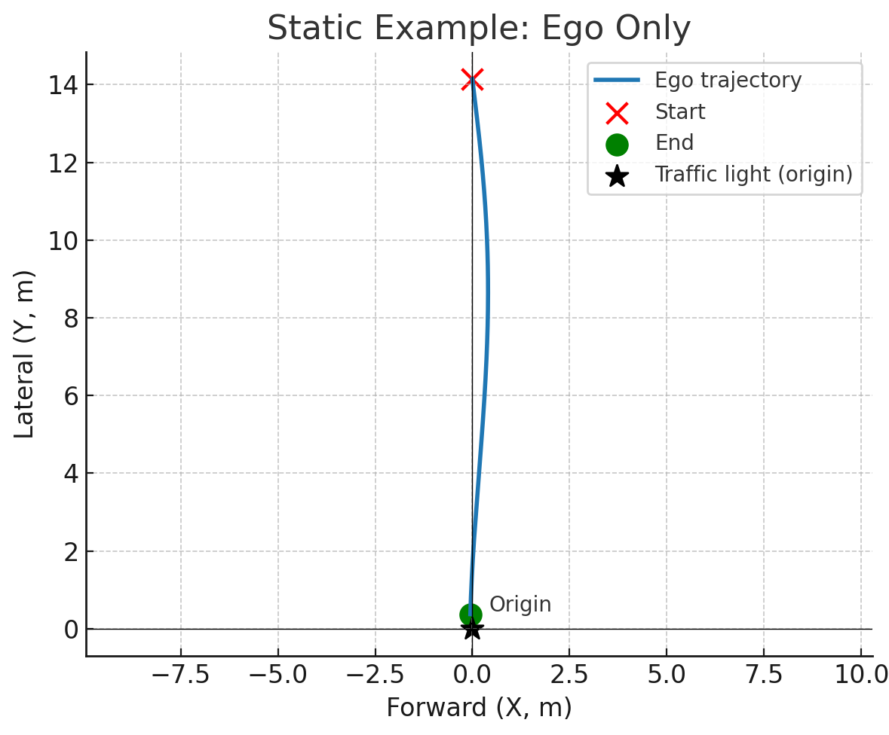
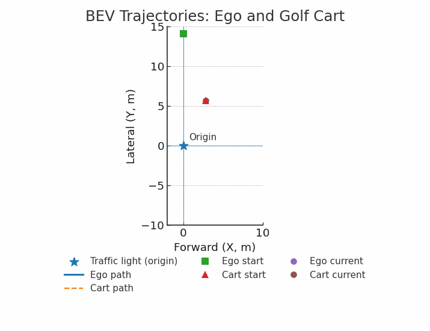
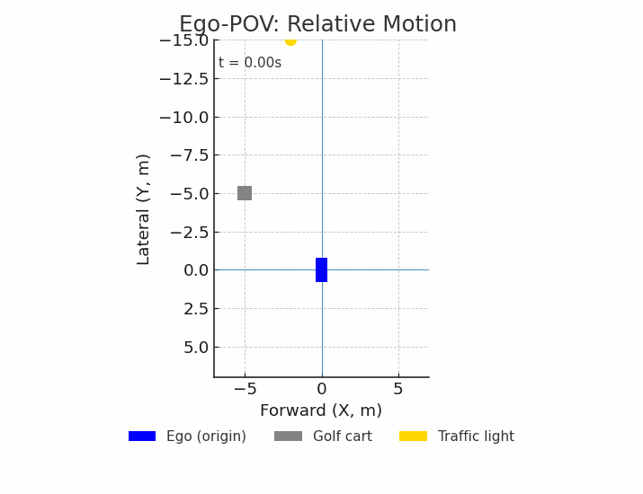
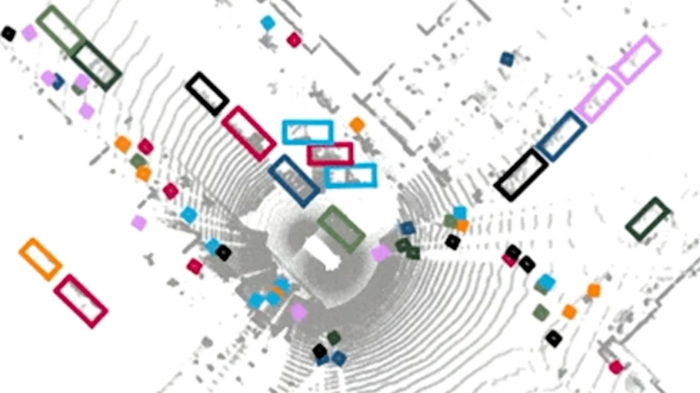

# Computer Vision Challenge: Ego-Trajectory & Bird’s-Eye View Mapping  

---
## Problem Overview
You are given a short **10-second video** recorded from an **ego-vehicle** (our Autonomous Car with a front-facing stereo camera). The scene includes:  

- A traffic light (fixed, overhead)  
- Several static barrels  
- A moving golf cart ahead of us  
- Occasionally, pedestrians  

Your task is to estimate and visualize the **ego-vehicle’s trajectory in the ground frame**, using the traffic light as a world reference.
You may then extend your solution by tracking additional objects and rendering a richer **Bird’s-Eye View (BEV)**.  

Use any tools you like — chatGPT and other assistants are highly encouraged. Please **do not** flood our e-mails with simple questions. GenAI is you friend.  

 

---
## Part A (Minimum Required)

1. **Traffic Light Tracking**  
   - You are provided with a CSV file containing the bounding box of the traffic light in each frame:  
     ```
     frame_id, x_min, y_min, x_max, y_max
     ```
   - Use the bounding box center (u, v) as the pixel location of the traffic light. alternatively, you could look into averging depth of a small patch around the center for better noise sensitivity.   

2. **3D Position from Depth Data**  
   - Each frame has a `.npz` file containing a 3D array of shape `(H, W, 3)`.  
   - This array encodes the point cloud in camera coordinates (meters).  
   - Camera coordinate system:  
     - +X → forward (aligned with car heading)  
     - +Y → right axis  
     - +Z → upward (perpendicular to ground, right-handed system)  
   - Depth maps give these values relative to the **top of the car**, with the camera centered along the vehicle width.  
   - Example (Python):  
     ```python
     import numpy as np
     xyz = np.load("xyz/frame_0001.npz")["points"]  # shape (H, W, 3)
     u, v = 640, 360  # example pixel location
     X, Y, Z = xyz[v, u]  # meters in camera coordinates; i.e. gets you absolute X,Y,Z from the center of the camera to the real world point represented by the pixel.
     ```

3. **Trajectory Extraction (Ground Frame Definition)**  
   - Define the **traffic light** as the reference world point.  
   - World frame setup:  
     - The **origin** is directly under the traffic light on the ground.  
     - The **Z-axis** passes upward through the traffic light.  
     - At t = 0, the line joining the car and the traffic light is aligned with the **+X axis**.  
     - This defines a right-handed coordinate system with (X forward, Y left, Z up).  
   - Use the apparent motion of the traffic light in the ego-camera frame to compute the ego-vehicle’s trajectory `(x_m, y_m)` projected onto the ground plane.  

4. **Outputs**  
   - `trajectory.png` (required): still plot of the ego-vehicle trajectory in BEV coordinates (X,Y plane; do not worry about the height in the final output) .  
   - `trajectory.mp4` (optional): animated BEV trajectory video (trajectory is drawn on a plot as a function of time)  

#### Here is a sample output for your reference, you dont have to make yours look similar as long as it is legible.


---

## Part B (Optional — Extra Credit)

Enhance your BEV scene by including other objects:  
- Golf cart (dynamic)  
- Barrels (static)  
- Other traffic lights or pedestrians (if visible)  

Note: Do not worry about the length of the objects, just plot the centers of the regions visible in the BEV.

**Expectations:**  
- Track additional objects in RGB (any method: color thresholding, template matching, ML, etc.)  
- Use depth/XYZ values to place them in the BEV  
- Render them along with your ego trajectory  
- Moving objects (golf cart, pedestrians) should update over time  
- You could have the traffic light color in the BEV video.
- Creativity is encouraged — richer BEVs score higher
- This optional part's BEV can be in car frame making your life a bit easy.   


 Sample Ground-Frame Animation                          |   Sample Ego-Frame Animation
:-------------------------:|:-------------------------:
 | 

---

## Dataset Structure

```
dataset/
│
├── rgb/ # Left camera RGB images
│ ├── frame_0001.png # (H, W, 3), uint8
│ ├── frame_0002.png
│ └── ...
│
├── xyz/ # Depth-based 3D point clouds
│ ├── frame_0001.npz # Contains key "points" → (H, W, 3), float32 in meters
│ ├── frame_0002.npz
│ └── ...
│
└── bboxes_light.csv # Traffic light bounding box per frame
 # Columns: frame_id,x_min,y_min,x_max,y_max

```

**Notes on data:**  
- Image size: 1920 × 1200 pixels (RGB).  
- Point cloud `.npz` files correspond 1:1 with RGB frames.  
- Intrinsics are included if you need reprojection or camera-to-world transforms.  
- Depth may have noise or invalid values (0/NaN) — handle gracefully.  

---

## Submission Requirements

1. `trajectory.png` (required)  
2. `trajectory.mp4` (optional)  
3.  Your Code
4.  Any extra plots, overlays, or videos
5. `report.pdf` (max 1 page):  
   - Describe your method, assumptions, and results  

- Please create a GitHub repository and [mail](wisconsinautonomous@gmail.com) us the link.
- Use **[Perception_Challenge_Fall2025]** as the subject or we will **not** evaluate your results.
---

## Evaluation Criteria 

- Correctness → Is the ego trajectory reasonable in the defined ground frame?   
- Clarity → Is your report correct or are your ideas right?  
- Each criteria will be graded on a scale of 1-5.


---
##### [Interesting stuff from NVIDIA](https://build.nvidia.com/nvidia/bevformer) for the curious.

